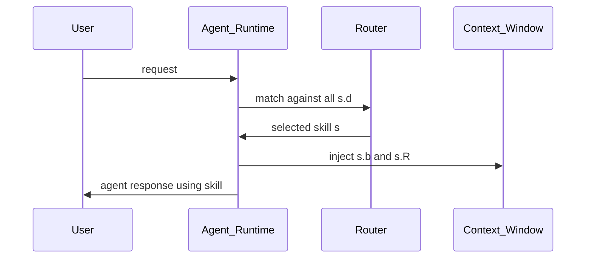
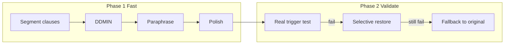
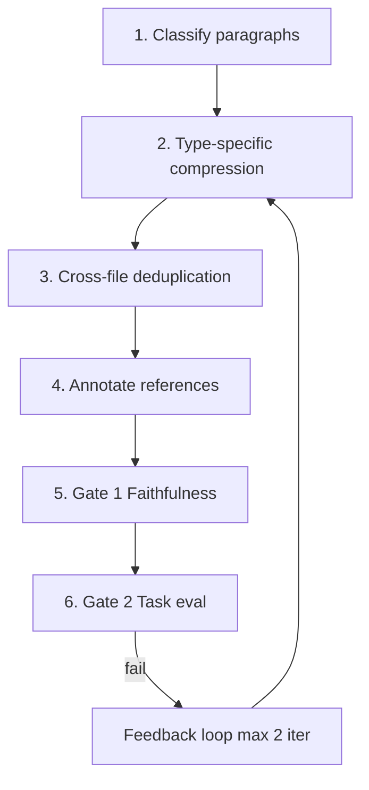

# SkillReducer Paper — Detailed Explanation

**Paper:** SkillReducer: Optimizing LLM Agent Skills for Token Efficiency  
**Authors:** Yudong Gao, Zongjie Li, Yuanyuan Yuan, Zimo Ji, Pingchuan Ma, Shuai Wang  
**Affiliations:** HKUST, Tsinghua University, Zhejiang University of Technology  
**arXiv:** [2603.29919](https://arxiv.org/abs/2603.29919) (v2, June 2026)  
**Local copy:** [`skill_reducer.pdf`](skill_reducer.pdf)

This document explains the paper in depth. **All framework design, algorithms, and empirical results are by Gao, Li, Yuan, Ji, Ma, and Wang (2026).** See [CITATION.md](CITATION.md) for proper attribution.

---

## Table of contents

1. [Executive summary](#1-executive-summary)
2. [Why skills exist — and why they bloat](#2-why-skills-exist--and-why-they-bloat)
3. [What is an LLM agent skill?](#3-what-is-an-llm-agent-skill)
4. [Empirical study of 55,315 skills](#4-empirical-study-of-55315-skills)
5. [The optimization objective](#5-the-optimization-objective)
6. [Stage 1: Routing layer optimization](#6-stage-1-routing-layer-optimization)
7. [Stage 2: Body restructuring via progressive disclosure](#7-stage-2-body-restructuring-via-progressive-disclosure)
8. [Quality safeguards](#8-quality-safeguards)
9. [Running example: marketing-strategy-pmm](#9-running-example-marketing-strategy-pmm)
10. [Evaluation (RQ1–RQ4)](#10-evaluation-rq1rq4)
11. [Ablation and component analysis](#11-ablation-and-component-analysis)
12. [Baseline comparison](#12-baseline-comparison)
13. [Cross-model and cross-framework generalization](#13-cross-model-and-cross-framework-generalization)
14. [Theoretical properties](#14-theoretical-properties)
15. [Threats to validity](#15-threats-to-validity)
16. [Related work](#16-related-work)
17. [Implications for skill authors](#17-implications-for-skill-authors)
18. [How this repository implements the paper](#18-how-this-repository-implements-the-paper)
19. [Glossary](#19-glossary)

---

## 1. Executive summary

LLM coding agents (Claude Code, Windsurf, OpenCode, and others) let developers extend agent behavior through **skills**: packaged instruction sets with routing metadata, a main body, optional reference files, and sometimes executable scripts.

Skills were designed to **save tokens** by reusing knowledge instead of repeating instructions every conversation. Ironically, poorly authored skills often **increase** token cost and **dilute** agent attention.

The authors crawled **55,315 public skills** and found systemic waste:

| Layer | Problem | Scale |
|-------|---------|-------|
| **Routing (description)** | Missing or too short → never selected; too long → wasted tokens | 26.4% missing; 44.1% missing or &lt;20 tokens |
| **Body** | Non-actionable content loaded every invocation | Only 38.5% is core rules |
| **References** | Full files injected regardless of task | Up to 1.67M tokens across 100 curated skills |

**SkillReducer** is a two-stage **debloating** framework (analogous to software debloating):

- **Stage 1** compresses or generates routing descriptions using **delta debugging** with a simulated routing oracle.
- **Stage 2** classifies body content into a taxonomy, keeps **core rules** always loaded, and moves examples/background/templates into **on-demand reference modules** (progressive disclosure).

**Results on 600 skills + SkillsBench:**

| Metric | Result |
|--------|--------|
| Description compression | 48% mean (56.5% for existing verbose descriptions) |
| Body compression | 39% mean (74.1% on SkillsBench) |
| Functional pass rate | 86.0% (score compressed ≥ original) |
| SkillsBench (deterministic) | 87/87 pass, zero regression |
| Quality vs original | **+2.8% improvement** (less-is-more effect) |
| Cross-model retention | 0.965 mean across 5 models |

The paper argues that **structure-aware** compression beats generic prompt pruning (LLMLingua, truncation, random removal) because skills mix actionable rules with supplementary content in one document.

---

## 2. Why skills exist — and why they bloat

### The original promise

Without skills, every conversation must re-explain:

- Team coding standards
- API conventions
- Domain workflows
- Tool-specific patterns

Skills encapsulate this as **reusable artifacts**: authored, versioned, shared via marketplaces (e.g. SkillHub), and loaded on demand.

### The cost model

When a skill is invoked, the runtime injects into the context window:

```
Total cost = |description| + |body| + Σ|reference files|
```

At typical API pricing, a **10,000-token skill** costs roughly **$0.03–$0.15 per invocation**. Teams with heavy agent usage can spend hundreds of dollars monthly on skill content alone.

Multiple active skills compound the problem against a fixed context budget (128K–200K tokens) shared with system prompts, chat history, and codebase context.

### Skill bloat

Like **software bloat** (unused code paths inflating binaries), **skill bloat** inflates tokens without improving outcomes:

- Verbose descriptions loaded into the router on **every** request
- Background explanations and examples loaded on **every** invocation even when irrelevant
- Reference files loaded **in full** when only a section is needed

The paper's core insight: authors mix **specification** (rules), **documentation** (background/examples), and **data** (templates/references) into monolithic files with no separation of concerns.

---

## 3. What is an LLM agent skill?

A skill `s` has four components (scripts are out of scope for token optimization):

| Symbol | Component | Role |
|--------|-----------|------|
| `s.d` | **Description** | Short text for routing — which skill matches the user query |
| `s.b` | **Body** | Main instruction document (usually Markdown) |
| `s.R` | **References** | Optional docs, templates, API specs |
| Scripts | **Executable code** | Invoked as tools; different token economics |

### Invocation flow



### Monolithic vs tiered architecture

| Pattern | Behavior |
|---------|----------|
| **Monolithic** | Entire skill in one file; all content loaded at once |
| **Tiered** | Compact core always loaded; supplementary modules fetched on demand via `read_file` or equivalent |

Stage 2 of SkillReducer **automates** monolithic → tiered transformation.

### Platform support

The skill format is converging across ecosystems. This tool targets the common pattern used by:

- **Anthropic Claude Code** — `SKILL.md` with YAML frontmatter
- **Windsurf**, **OpenCode**, and other coding agents — similar skill directories
- **SkillHub** — curated marketplace skills
- **Community / GitHub** — 55K+ wild skills in the paper's dataset

The canonical entry file is **`SKILL.md`** (case-insensitive). Description lives in frontmatter; body is Markdown below.

---

## 4. Empirical study of 55,315 skills

The paper analyzes three sources:

| Source | Count | Notes |
|--------|-------|-------|
| **Wild** | 55,315 | GitHub, deduplicated by content hash |
| **SkillHub** | 100 | Editorially curated |
| **Community** | 620 | Forums and social platforms |

### Finding 1 (F1): Description quality is bimodal

**Too short or missing (26.4%):**

- Router can never match the skill to relevant queries
- Description tokens still appear in the candidate pool → **wasted on every call**

**Too verbose (many SkillHub skills ~48 tokens average):**

- Exhaustive feature lists
- Redundant trigger phrase enumerations ("use when user mentions X, Y, Z…")
- Usage examples in the description that don't help distinguish from competitors

**Design requirement → Stage 1:** Minimally sufficient descriptions — generate missing ones; compress verbose ones to routing-essential content only.

### Finding 2 (F2): Body content taxonomy

The authors sampled 90 skills (30 per source), yielding **15,107 paragraph-level items**, classified into five types:

| Type | Count | % | Treatment |
|------|-------|---|-----------|
| **Core rule** | 5,817 | 38.5% | Always loaded |
| **Background** | 6,156 | 40.7% | On-demand |
| **Example** | 1,948 | 12.9% | On-demand |
| **Template** | 1,141 | 7.6% | On-demand |
| **Redundant** | 45 | 0.3% | Discard |

**Validation:** GMM clustering (k=5) on embeddings aligns with LLM labels (silhouette = 0.393, moderate separation).

**Design requirement → Stage 2:** Separate core rules from non-core; defer non-core to on-demand modules.

### Finding 3 (F3): Reference file composition

Among Wild skills:

- 67.5% single-file (`SKILL.md` only)
- 14.8% include reference files
- 8.3% include scripts

For 100 SkillHub skills with references: **505 files, 1.67M tokens total** — a single invocation can inject tens of thousands of reference tokens.

**Design requirement → Stage 2:** Deduplicate body–reference overlap; add routing metadata for selective loading.

---

## 5. The optimization objective

**Input:** skill `s = (s.d, s.b, s.R)`

**Output:** optimized `s' = (s'.d, b*, R*)` where:

```
Cost(s)  = |s.d| + |s.b| + Σ|r|           (always loaded)
Cost'(s) = |s'.d| + |b*| + Σ|r_used|       (references loaded on demand)
```

**Constraints:**

1. **Routing equivalence** — `s'` is selected for the same queries as `s`
2. **Functional retention** — agent using `s'` achieves ≥ performance of `s`

**Goal:** `Cost(s') ≪ Cost(s)` subject to both constraints.

---

## 6. Stage 1: Routing layer optimization

Stage 1 handles **both ends** of the bimodal description problem: generate missing descriptions, compress verbose ones.

### Overview



### Phase 1: Delta debugging with simulated oracle

**Semantic segmentation:** Split description into clauses (not sentences or words). Each clause = one routing-relevant concept (e.g. "JWT authentication", "OAuth 2.0 support").

**DDMIN algorithm** (Zeller & Hildebrandt, 2002):

- Input: clause set `U = {u₁, …, uₙ}`, oracle `O`, test queries `Q`
- Output: 1-minimal subset `U* ⊆ U` where every remaining clause is individually necessary
- Complexity: O(n log n) oracle calls vs O(2ⁿ) exhaustive

**Simulated routing oracle** `O_sim(d, Q, C) → {0, 1}`:

- **Q** = test queries that should trigger the skill
- **C** = candidate pool:
  - Target skill
  - 4 **distractors** (TF-IDF cosine similarity on name + description)
  - 1 **adversarial skill** (LLM-generated: same domain, different purpose — e.g. "JWT auth" vs "OAuth token refresh")
- Candidate order **randomized** per query (avoid positional bias)
- Pass iff routing model selects target for **all** queries

**After DDMIN:**

1. Paraphrase each retained clause shorter (accept only if oracle still passes)
2. Polish joined text for grammar

### Phase 2: Real-environment validation

The simulated oracle is fast (~2s/call) but can be **overly optimistic**. Phase 2 bridges to real routing:

1. Establish baseline: `Q_val` = queries that trigger with **original** description
2. Test compressed description on real agent runtime (paper: Claude Code CLI, stream event parsing)
3. If any fail → **selective restore**: greedily re-add deleted clauses (max 3 steps)
4. If restore fails → **fallback to original**

**Paper results (600 skills):**

| Outcome | Count |
|---------|-------|
| Direct pass | 252 (42.0%) |
| Pass after selective restore | 245 (40.8%) |
| Fallback to original | 39 (6.5%) |
| Obsolete (original also fails) | 64 (10.7%) |
| **Routing preserved (non-obsolete)** | **536/536 (100%)** |

### Description generation (missing/short ≤40 tokens)

For skills without usable descriptions, LLM extracts from body:

1. Primary capability (20–40 tokens)
2. Trigger condition (20–40 tokens)
3. Unique identifiers — library names, API endpoints (20–40 tokens)

Validated through Phase 1 oracle before acceptance.

---

## 7. Stage 2: Body restructuring via progressive disclosure

### Pipeline (Algorithm 2)



### Step 1: Content classification

Paragraph-level items → five taxonomy categories. Only **core rules** stay in always-loaded module `b*`. Others → reference modules:

| Module | Content |
|--------|---------|
| `b*` (SKILL.md body) | Core rules |
| `examples.md` | Illustrative code, I/O pairs |
| `templates.md` | Copy-paste boilerplate |
| `background.md` | Explanations, rationale |
| (discarded) | Redundant items |

Analogous to **program slicing**: identify what directly affects task execution; defer the rest. Skill content lacks formal dependency graphs, so taxonomy + feedback loop approximate slicing.

**Conservative fallback:** unclassified items → core rule.

### Step 2: Type-specific compression

| Type | Method |
|------|--------|
| Core rules | Merge by semantic similarity; concise bullets; output strictly shorter |
| Examples | Group by concept; 1 representative per concept; strip comments (~60–70% reduction) |
| Templates | Deduplicate by concept |
| Background | Summarize to one paragraph; preserve numbers, thresholds, API endpoints |

### Step 3: Cross-file deduplication

For existing `s.R`:

- Detect overlap with original body `s.b` and body-derived modules
- Remove duplicated content from references
- Discard references &lt; 30 tokens (fully redundant)

### Step 4: Reference annotation

Each reference gets routing metadata:

- **`when`** — trigger clause ("you need to write YAML configuration")
- **`topics`** — 3–5 keywords

Enables agent to decide whether to load without reading full file first.

### Step 5: Quality gates

See [Section 8](#8-quality-safeguards).

---

## 8. Quality safeguards

Three mechanisms in sequence:

### Gate 1: Faithfulness verification

LLM checks: all key **operational concepts** from original are preserved in compressed core ∪ references.

Per content type (core, examples, templates, background) — only failing types roll back.

Formal condition:

```
∀τ : C_τ(s.b) ⊆ C_τ(b*) ∪ ⋃_{r∈R*} C_τ(r)
```

Necessary but not sufficient — preserved concepts can still confuse agents in practice.

### Gate 2: Task-based evaluation

**5 diverse tasks per skill:**

- Mix of **core-only** (answerable from `b*` alone)
- **Needs-reference** (requires loading a reference module)

**Three conditions:**

| Condition | Content provided |
|-----------|------------------|
| **D** (lower bound) | No skill |
| **A** (baseline) | Original `s.b` + all `s.R` |
| **C** (compressed) | Core `b*` + references via `read_file` (max 6 calls) |

**Scoring:**

- 52.3% code execution tasks → pytest-style assertions (deterministic)
- 47.7% rubric tasks → LLM judge (separate model from compression)

**Retention metric** for task `t`:

```
Retention(t) = 1.0                          if score_A(t) = 0
             = min(score_C(t)/score_A(t), 1) otherwise
```

Pass Gate 2 iff `Retention(t) = 1.0` for all tasks.

### Feedback loop

If `score_C < score_A`:

1. Analyze failed rubric criteria
2. Identify which non-core items are needed
3. **Promote** those items to core (original form, not re-compressed)
4. Recompress non-promoted core items
5. Re-run Gate 2 (max 2 iterations)

**Termination:** core set grows monotonically; capped at 2 iterations for cost.

**Paper:** 38/600 skills triggered feedback; 31/38 recovered (81.6%).

### Fallback

If feedback fails after 2 iterations → keep best compression (most promoted items).

---

## 9. Running example: marketing-strategy-pmm

| Component | Original | Compressed | Reduction |
|-----------|----------|------------|-----------|
| Description | 87 tok | 32 tok | 63% |
| Body (always loaded) | 2,543 tok | 540 tok | 79% |
| References (on demand) | 9,476 tok | 6,691 tok | 29% |
| **Core-only invocation** | 2,543 tok | 540 tok | **79%** |
| Total if all loaded | 12,019 tok | 7,231 tok | 40% |

**Stage 1 insight:** Trigger-phrase list was redundant — router infers triggers from feature keywords alone.

**Stage 2 split:**

- Core: KPIs, methodology steps, decision criteria
- `templates.md`: HubSpot config snippets
- `examples.md`: persona-specific messaging
- `background.md`: positioning methodologies

**Gate 2:** score_C = 1.0 vs score_A = 0.93 (less-is-more).

---

## 10. Evaluation (RQ1–RQ4)

### Datasets

| Set | Size | Purpose |
|-----|------|---------|
| Official (SkillHub) | 87 | Curated skills |
| Community | 464 | Shared skills |
| Wild (sampled) | 49 | Stratified by body length |
| SkillsBench | 87 tasks | External benchmark, pytest verifiers |

### RQ1: Token reduction

| Stage | Mean reduction |
|-------|----------------|
| Stage 1 (descriptions) | 48.0% |
| Stage 1 (compress only) | 56.5% |
| Stage 1 (generate + compress) | 44.6% |
| Stage 2 (body) | 39.0% |
| Stage 2 (SkillsBench) | 74.1% |
| End-to-end best case | 26.8% |

**Wild scalability (198 skills, Gate 1 only):** 77.5% mean core reduction; larger bodies compress more (up to 95.8% for &gt;10K tokens).

**Cost:** ~$14–18 to compress 600 skills (one-time, amortized over hundreds of invocations per skill).

### RQ2: Functional quality

| Metric | Value |
|--------|-------|
| Pass rate (score_C ≥ score_A) | 86.0% |
| C improves over A | 25.3% |
| C regresses vs A | 14.0% |
| True compression failures | 4.7% |
| SkillsBench | 87/87 |

**Less-is-more:** C avg 0.742 vs A 0.722 (p=0.002, d=0.107). Effect stronger on longer official skills (+11.8pp).

**Regression breakdown:**

- 50% skill obsolescence (D performs equally)
- 17% evaluation noise
- 33% true compression regression

**Main failure mode:** **example-as-specification** — examples that implicitly define behavior moved to references but needed in core.

### RQ3: Component contribution

See [Section 11](#11-ablation-and-component-analysis).

### RQ4: Generalization

See [Section 13](#13-cross-model-and-cross-framework-generalization).

---

## 11. Ablation and component analysis

Six conditions on 50 skills × 5 tasks:

| Condition | Components | Score | Retention | Δ vs A |
|-----------|------------|-------|-----------|--------|
| D | No skill | 0.559 | 0.596 | −0.380 |
| A | Original | 0.939 | 1.000 | — |
| C | Full pipeline | 0.926 | 0.987 | −0.012 |
| C1 | Description only | 0.925 | 0.985 | −0.014 |
| C2 | Body compress, no classify | 0.882 | 0.940 | −0.056 |
| C3 | Ref dedup only | 0.944 | 1.000 | +0.005 |
| C4 | Compress all, no classify | 0.863 | 0.919 | −0.076 |

**Key insight:** Taxonomy classification is essential (6.8pp gap without it). Description compression barely affects task scores (routing layer only). Reference deduplication is safest component (pure less-is-more).

**Retention by compression ratio** stays 0.910–0.956 from &lt;20% to &gt;80% compression — aggressive compression doesn't systematically increase risk.

---

## 12. Baseline comparison

Same token budget, 50 skills, 3–5 tasks each:

| Method | Score | Retention | vs SkillReducer |
|--------|-------|-----------|-----------------|
| A (Original) | 0.921 | — | — |
| C (SkillReducer) | 0.909 | 0.949 | — |
| P (LLMLingua) | 0.767 | 0.820 | p &lt; 0.001 |
| L (LLM direct compress) | 0.866 | 0.918 | p = 0.003 |
| T (Truncation) | 0.791 | 0.845 | p &lt; 0.001 |
| R (Random sentence removal) | 0.694 | 0.750 | p &lt; 0.001 |

**Why LLMLingua fails on skills:** Perplexity pruning removes linguistically predictable but **operationally critical** tokens. Taxonomy preserves all core rules.

---

## 13. Cross-model and cross-framework generalization

### Five models (30 skills, 5 tasks each)

| Model | score_A | score_C | Retention |
|-------|---------|---------|-----------|
| GLM-5 | 0.926 | 0.962 | 0.986 |
| DeepSeek-V3 | 0.936 | 0.963 | 0.978 |
| Qwen3-max | 0.931 | 0.930 | 0.955 |
| GPT-OSS-120B | 0.951 | 0.958 | 0.982 |
| Qwen2.5-7B | 0.920 | 0.893 | 0.939 |
| **Mean** | 0.933 | 0.941 | **0.965** |

Compression by DeepSeek-V3 transfers to smaller models (Qwen2.5-7B: 0.939 retention).

### Cross-compressor validation

Re-compress with Qwen3-max and Qwen2.5-7B → retention 0.897 and 0.874 vs 0.896 (DeepSeek-V3). Structure-aware design matters more than compressor capability.

### OpenCode framework

30 skills on OpenCode v1.2.27: retention **0.944** (consistent with main evaluation). Compressed scores 0.764 vs original 0.751.

### Skill obsolescence

10.7% of skills don't trigger even with original descriptions. As base models improve, some skills become redundant (SkillsBench: D passes 86/87). Weaker models benefit most from skills (Qwen2.5-7B largest A−D gap).

---

## 14. Theoretical properties

### Feedback loop convergence (Proposition 1)

Core set `I_core` grows monotonically: `I⁽⁰⁾_core ⊆ I⁽¹⁾_core ⊆ …`

Terminates in at most `|I| − |I⁽⁰⁾_core|` steps (capped at K=2 in practice).

### Expected cost under progressive disclosure (Proposition 2)

```
E[Cost'(s)] = |s'.d| + α·ρ·|s.b| + Σ p_j·|r*_j|
```

Empirical values: ρ=0.383 (core fraction), α≈0.63 (core compression), p≈0.30 (reference load rate).

**Expected body reduction:** 43.2%–57.4% depending on assumptions. Measured end-to-end: 26.8%–43.2%.

---

## 15. Threats to validity

| Threat | Mitigation |
|--------|------------|
| LLM classifier randomness | Temperature 0, conservative fallbacks, feedback loop |
| Gate 2 dual role (optimize + evaluate) | Independent SkillsBench (87/87) |
| LLM judge bias | Separate compression/evaluation models; κ=0.939 vs code execution on 1,646 tasks |
| Platform generalization | Cross-model + OpenCode; other IDE agents not directly tested |
| Wild skills lack Gate 2 | Gate 1 only on 198-sample scalability study |
| Finite test suite | Analogous to incomplete software testing |

---

## 16. Related work

| Area | Examples | vs SkillReducer |
|------|----------|-----------------|
| Token pruning | LLMLingua, Selective Context | Flat sequence; can't separate rules from examples |
| Embedding compression | Gisting | Learned soft tokens; not skill-structure-aware |
| Tool doc compression | Concise Context (Xu et al.) | Requires task-specific training data |
| Context management | RAG, AgentCompress | Runtime/history; not skill authoring |
| Prompt optimization | APE, CodeAct | Authoring-time; SkillReducer is post-authoring build step |
| Security | Agent Skills in the Wild (31K skills) | Complementary concern |

SkillReducer adapts **software debloating**, **delta debugging**, and **program slicing** to natural-language skills.

---

## 17. Implications for skill authors

### Do

1. **Write a routing-focused description** — capability + trigger + identifiers; third person; avoid feature laundry lists
2. **Keep SKILL.md body to core rules** — what the agent must always follow
3. **Move examples to `examples.md`** — link from core with clear "when to read"
4. **Move templates to `templates.md`** — one representative per pattern
5. **Summarize background** — or defer to `background.md`
6. **Deduplicate** — don't repeat body content in reference files
7. **Treat examples as specs carefully** — if an example defines expected behavior, keep it in core

### Don't

1. Leave description empty (26.4% of wild skills do this)
2. Embed 10+ trigger phrases in description
3. Paste full API docs into SKILL.md
4. Load 50K tokens of references when 500 tokens of core would suffice
5. Use generic compression (truncation, LLMLingua) on skills — loses operational tokens

### Architecture target

```
skill-name/
├── SKILL.md          # description + core rules + links (always loaded)
├── examples.md       # on-demand
├── templates.md      # on-demand
├── background.md     # on-demand
└── scripts/          # executed, not context-injected
```

---

## 18. How this repository implements the paper

| Paper component | Implementation status |
|-----------------|----------------------|
| Token counting (cl100k_base) | ✅ `tokenizer.py` |
| SKILL.md parse/write | ✅ `parser.py` (supports `SKILL.md` / `skill.md`) |
| Audit F1/F2/F3 flags | ✅ `audit.py` |
| Stage 1 description generation | ✅ `stage1/generate.py` |
| Stage 1 semantic segmentation | ✅ `stage1/segment.py` |
| Stage 1 DDMIN | ✅ `stage1/ddmin.py` |
| Stage 1 paraphrase + selective restore | ✅ `stage1/compress.py` |
| Simulated routing oracle | ✅ Heuristic + optional LLM |
| Real trigger validation (agent CLI) | 🔲 Planned |
| Stage 2 taxonomy classification | ✅ `stage2/classify.py` |
| Stage 2 type-specific compression | ✅ `stage2/compress.py` |
| Progressive disclosure writer | ✅ `stage2/disclose.py` |
| Cross-file deduplication | ✅ `stage2/dedup.py` |
| Reference when/topics metadata | ✅ `stage2/disclose.py` |
| Gate 1 faithfulness | 🔲 Planned |
| Gate 2 task eval + feedback | 🔲 Planned (`--strict`) |
| Adversarial distractor skills | 🔲 Planned |
| TF-IDF distractor pool | 🔲 Planned |

**Heuristic fallback (`--no-llm`):** Rule-based segmentation, classification, and compression when no API key is set — useful for offline audit and basic reduction.

**Platform scope:** Works on any skill directory using the standard `SKILL.md` + YAML frontmatter convention (Claude Code, Windsurf, SkillHub, GitHub community skills, and similar agent platforms).

---

## 19. Glossary

| Term | Definition |
|------|------------|
| **Skill** | Pre-packaged instruction set extending LLM agent behavior |
| **Routing layer** | Description field used to select which skill to invoke |
| **Skill bloat** | Non-essential content inflating token cost without improving outcomes |
| **Progressive disclosure** | Load essential content first; fetch details on demand |
| **DDMIN** | Delta debugging minimization algorithm |
| **1-minimal** | Every remaining element is individually necessary for the oracle to pass |
| **Core rule** | Actionable instruction the agent must follow |
| **Oracle** | Predicate testing whether a description enables correct routing |
| **Retention** | Ratio of compressed task score to original task score |
| **Less-is-more** | Compressed skills outperform originals by reducing distraction |
| **Example-as-specification** | Example content that implicitly defines required behavior |
| **Gate 1** | Faithfulness check — concepts preserved across compression |
| **Gate 2** | Task-based functional evaluation |
| **Promotion** | Moving failed reference content back into always-loaded core |

---

## References (from paper)

- Anthropic Claude Code docs
- Zeller & Hildebrandt — Delta Debugging (TSE 2002)
- Jiang et al. — LLMLingua (EMNLP 2023)
- Nielsen — Progressive Disclosure (NN/g 2006)
- Weiser — Program Slicing (TSE 1984)
- Quach et al. — Software Debloating (USENIX Security 2018)
- Li et al. — SkillsBench (arXiv 2602.12670)
- Liu et al. — Lost in the Middle (TACL 2024)
- Shi et al. — Distracted by Irrelevant Context (ICML 2023)

---

*For the full academic treatment, equations, and appendices, see [`skill_reducer.pdf`](skill_reducer.pdf).*
